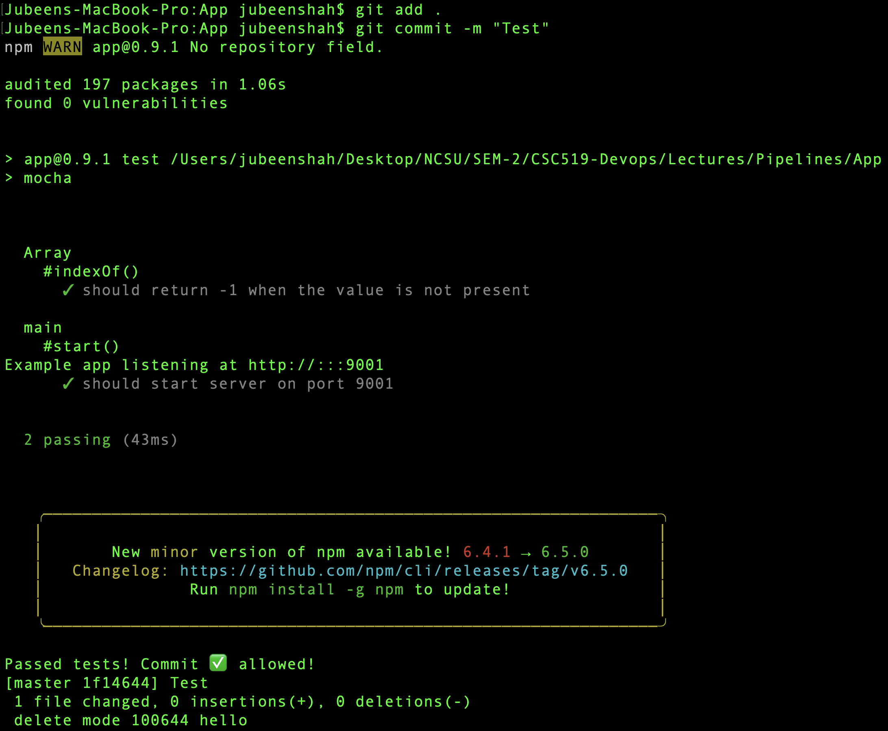
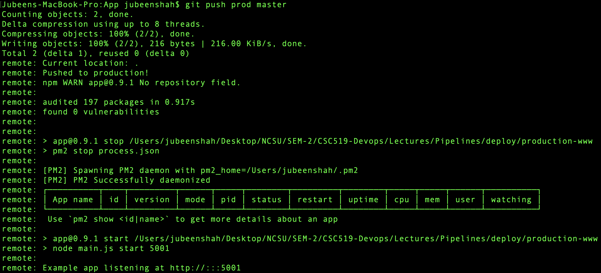
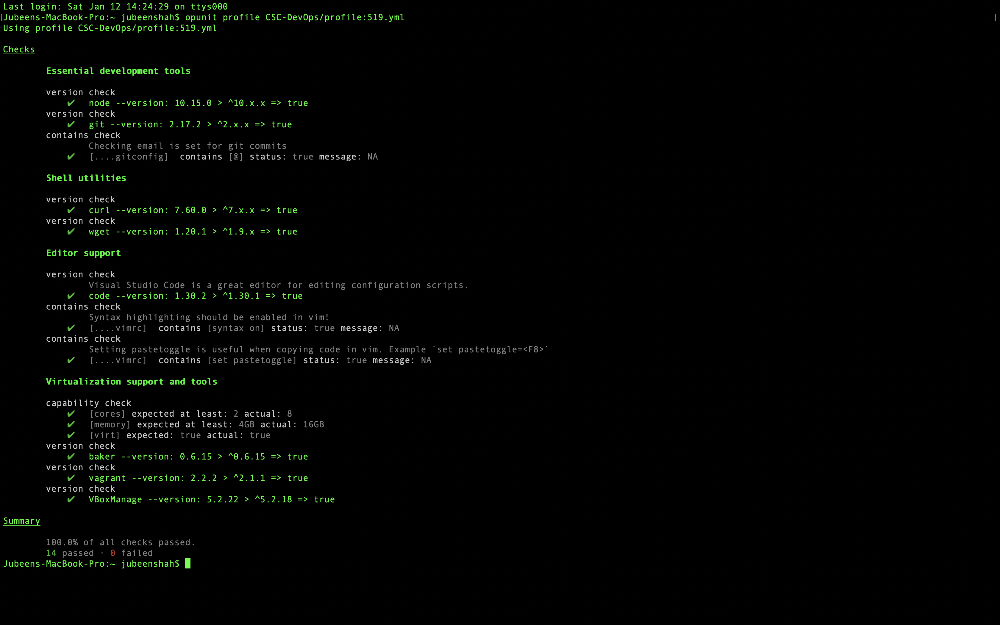
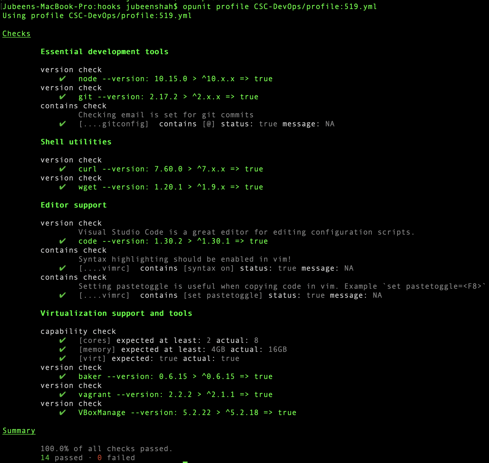

# HW0 - Pipelines


| [Jubeen Shah](www.jubeenshah.com) | [JNSHAH2](mailto:jnshah2@ncsu.edu) | [DEVOPS CSC519](https://github.com/CSC-DevOps) |

## Content
1. [About the Homework](#about)
2. [Explaining GitHooks](#git-hooks)
3. [Outputs](#output)
4. [Screencast Link](#screencast)

### About
In this homework I've learned to set up a simple delivery pipeline using GIt Hooks. The repo includes [3 types of hook files](#Git Hooks) which were used to help with the understanding and implementation of hooks as means of automating the deployment process. Finally, I also show the [output](#Output) of the same using screenshots followed by the [link to the screencast](https://youtu.be/WlYsmlYm36w?t=29)  of the entire process.

### Git Hooks
1. **Pre-Commit** - In this a simple script was written that would execute a test using `npm test` to check whether or not a particular commit is allowed or not. If the test fails, the commit would be cancelled, and accepted otherwise. [Link to Script](./Scripts/pre-commit)
```shell
#!/bin/bash

npm install
# Get the exit code of tests.
if npm test; then
echo "Passed tests! Commit ✅ allowed!"
exit 0
fi
echo "Failed npm tests. Canceling 🚫 commit!"
exit 1
```

2. **Post-commit** - In this another script was written that would simply execute a `post-commit` hook that would simply open a webpage, in this case [`www.google.com`](https://www.google.com). So as soon as a commit is made, the `post-commit` hook would execute a task, this could be anything. [Link to Script](./Scripts/post-commit)

```shell
#!/bin/sh

# In Mac
open https://google.com/
```


3. **Post-receive** - A hook script was written to to copy the updated code from the deployment environment to the production environment, after a link was setup between the two. [Link to Script](./Scripts/post-receive)

```shell
#!/bin/sh
echo "Current location: $GIT_DIR"
GIT_WORK_TREE=../production-www/ git checkout -f
echo "Pushed to production!"
cd ../production-www
npm install --production
npm run stop
npm run start
```


### Output

1. **Pre-Commit** 

2. **Post-Receive**

3.  The test results using `opunit verify local` (100% Pass)

4. Finally test results using `opunit profile CSC-DevOps/profile:519.yml` (100% Pass)



### Screencast
* [YouTube](https://youtu.be/WlYsmlYm36w?t=29)

